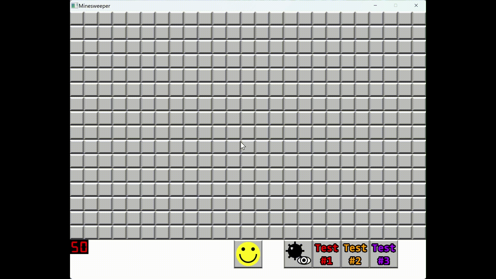

# Minesweeper



## Description

A recreation of the classic Minesweeper game implemented using SFML version 2.5.

## Dependencies

- git
- cmake

Note: On Linux, you may also need to install the following dependencies for SFML to work properly:

- libfreetype6-dev
- libopenal-dev
- libvorbis-dev
- libflac-dev

## Installation

1. Clone the repository:
   ```bash
   git clone https://github.com/GiovanniCornejo/Minesweeper.git
   cd Minesweeper
   ```
2. Create a build directory to hold the project:
   ```bash
   mkdir build
   cd build
   ```
3. Generate the build files using CMake and compile:

   ```bash
   cmake ..
   make
   ```

4. Run the executable:

- On Windows:
  ```bash
  ./Minesweeper.exe
  ```
- On Linux:
  ```bash
  ./Minesweeper
  ```

## Rules Overview

The rules of the game are as follows:

- The game board contains a grid of spaces, some of which may contain mines.
- Players click on a space to reveal it.
- The objective is to reveal all non-mine spaces while avoiding mines.
- When a space is revealed:
  - If it's a mine, the game ends.
  - If it's not a mine, it shows the number of adjacent mines.
  - If a space has no adjacent mines, all adjacent non-mine spaces are also revealed.
- Players use the numbers as clues to identify mine locations.
- Revealing all non-mine spaces leads to victory.

## Core Features

### Flags

- Right-clicking a hidden space places a flag, marking it as a possible mine.
- Flagged spaces cannot be revealed, but flags can be removed with another right-click.

### Mine Counter

- Tracks the number of mines on the board.
- Decreases by one when a flag is placed and increases by one when a flag is removed.
- The mine counter can go negative.

### Restart Button

- The smiley face icon at the bottom of the window lets players restart the game with a new board.

## Non-standard Features

### Debug Button

- Toggles the visibility of mines on the board.
- Useful for testing and debugging game features.

### Test Buttons #1-3

- Developer shortcuts for testing specific game scenarios.
- Speeds up the development process by allowing quick testing of different game states.

## License

This project is licensed under the [MIT License](LICENSE).
